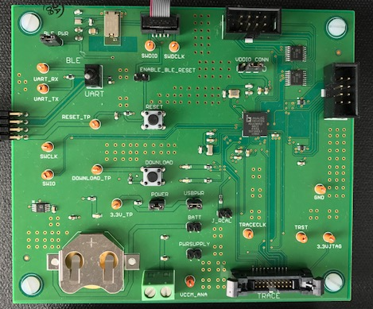

# Eagle_EIT
## EIT PCB design in Eagle CAD

Electrical Impedance Tomography is a new way to image conductivity changes inside any mostly liquid medium - such as the human body. It's attractive as it doesn't use ionizing radiation like the X-rays used in a CATSCAN, and could be relatively cheap to mass produce. 

This project is an example of a working system from PCB to firmware to reconstruction algorithm. Further work could certainly improve the resolution, but for now we have functionality in all sub sections. 

This is everything required for the basic 8 electrode design to work. Photo of the assembled PCB included. 

The design is based on the ADuCM350 which has a dedicated high precision front end with 16 bit resolution 160 kSPS data speed.The front end also performs a DFT at the rate of 13.8ms per calculation. This leads to a high performance minimal noise set up, excellent for both R&D or educational purposes. 

In the not too distant future kits may be available with a smaller version of the PCB mounted in a box, an electrode harness for mounting to the body, and all cables required to run. 

This combination would be an excellent educational tool for those researching this area, as it allows you to try most of the reconstruction algorithms or come up with your own and quantify any improvements in results. 

It's the same technique as is used in CATSCAN's, except the current running through the body instead of dangerous ionizing radiation of X-Rays. 

Improvements are welcome to this design. To increase resolution you could make a rotational version which is time resolution limited, or simply add more electrodes and re-compute the reconstruction that way. Another intended improvement is to move to tetrapolar differential electrodes set up. If you'd like to collaborate just pull the repository or email contact@mindseyebiomedical.com

We'd love to hear how you are using this! 

this is my first test.
